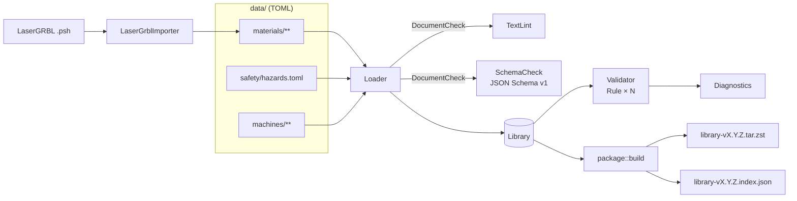

# Arquitetura

## Objetivo

Manter uma biblioteca de dados (materiais, máquinas, perigos) **validada por
código** e publicada como um pacote versionado e verificável. O código Rust é a
única fonte de verdade do formato: os JSON Schemas são gerados a partir dele.

## Fluxo

1. **Loader** (`loader.rs`) percorre `data/`, lê cada TOML, converte para JSON e
   passa por uma lista de `DocumentCheck` (lint de texto, JSON Schema). Só os
   arquivos sem erro são desserializados para os tipos de `model/`.
2. **Validator** (`validate/`) executa regras semânticas (`Rule`) sobre a
   `Library` inteira: unicidade, faixas plausíveis, referências cruzadas,
   evidências, licenças de origem, perigos.
3. **package** (`package/`) gera JSON normalizado de cada documento, o índice
   com SHA-256 e um `.tar.zst` reprodutível; `read_archive` verifica o pacote.
4. **import** (`import/`) converte bibliotecas de terceiros em `Material`s e as
   grava no layout canônico de TOML.

`freekerf_library::check(&Layout)` = Loader padrão + `Validator::standard()`.

## Módulos (`crates/freekerf-library/src`)

| Módulo | Responsabilidade |
| --- | --- |
| `model/` | Tipos serde + `JsonSchema` (Material, Recipe, Confidence, Machine, HazardList) |
| `schema.rs` | Gera/compara `schema/v1/*.schema.json`; compila validadores |
| `layout.rs` | Onde cada coisa fica no checkout |
| `loader.rs` | Leitura + `DocumentCheck` (`TextLint`, `SchemaCheck`) → `Library` |
| `validate/` | `Rule` + `Validator`; uma regra por arquivo |
| `safety.rs` | `HazardMatcher` (palavras inteiras, sem acento, `unless`) |
| `package/` | Índice, `.tar.zst`, leitura com verificação |
| `import/` | `Importer`, escritor TOML canônico, `lasergrbl/` |
| `diagnostics.rs` | `Diagnostic`/`Diagnostics` (texto e JSON) |
| `text.rs` | Normalização, slug, busca por frase |

A CLI (`crates/freekerf-library-cli`) só traduz argumentos em chamadas da
biblioteca e imprime resultados.

## Pontos de extensão

| Quero… | Faça |
| --- | --- |
| nova verificação semântica | `impl Rule` em `validate/<nome>.rs`, registre em `Validator::standard()`, teste com `validate::fixtures` |
| nova verificação de arquivo | `impl DocumentCheck`, registre em `Loader::default()` |
| novo importador | módulo em `import/<fonte>/` com `impl Importer`, colaboradores injetados por trait |
| novo campo no formato | campo opcional no `model/`, `cargo run -- schema`, doc em `features/data-format.md` |
| mudança incompatível | `schema/v2`, novo `FORMAT_VERSION`, plano de migração no roadmap |

## Decisões

- **Rust** para todas as ferramentas: o consumidor (`freekerf-materials`) também
  é Rust e pode reutilizar o crate `freekerf-library` (modelo + `read_archive`).
- **TOML** para os dados (diff legível); **JSON** dentro do pacote (consumo
  universal).
- **Schema gerado do código** (schemars) em vez de escrito à mão: impossível
  divergir; o CI confere.
- **Validação em duas camadas**: JSON Schema (estrutura, faixas absolutas,
  mensagens com ponteiro JSON) e regras Rust (plausibilidade por tecnologia de
  laser, referências, evidências, segurança).
- **Unidades no nome do campo** (`speed_mm_min`, `power_max_pct`…) e
  `x-unit` no schema.
- **Pacote reprodutível**: entradas ordenadas, mtime fixo
  (`SOURCE_DATE_EPOCH`), dono 0, compressão zstd 19.
- **Avisos de perigo `warn` não são erros de dados**: vão para o índice
  (`materials[].hazards`) para o app alertar; `block` reprova a validação.
- **Sem telemetria.**
